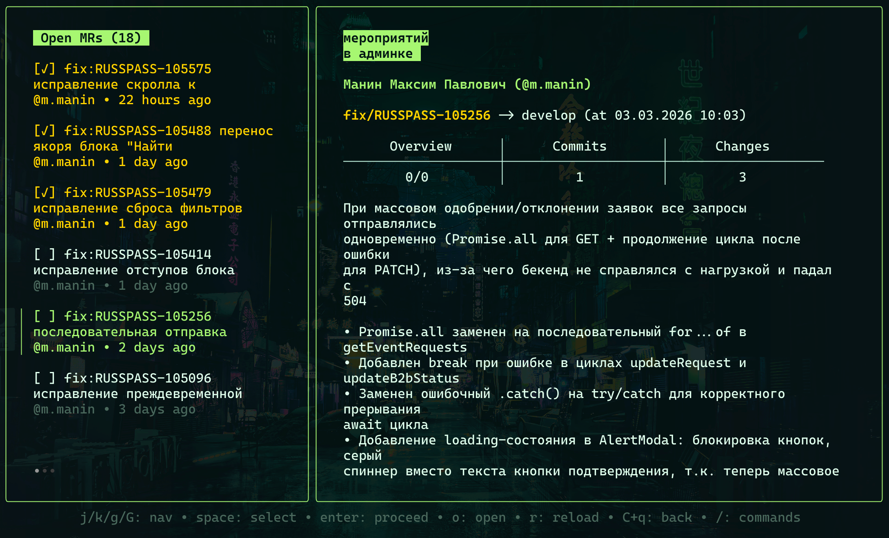
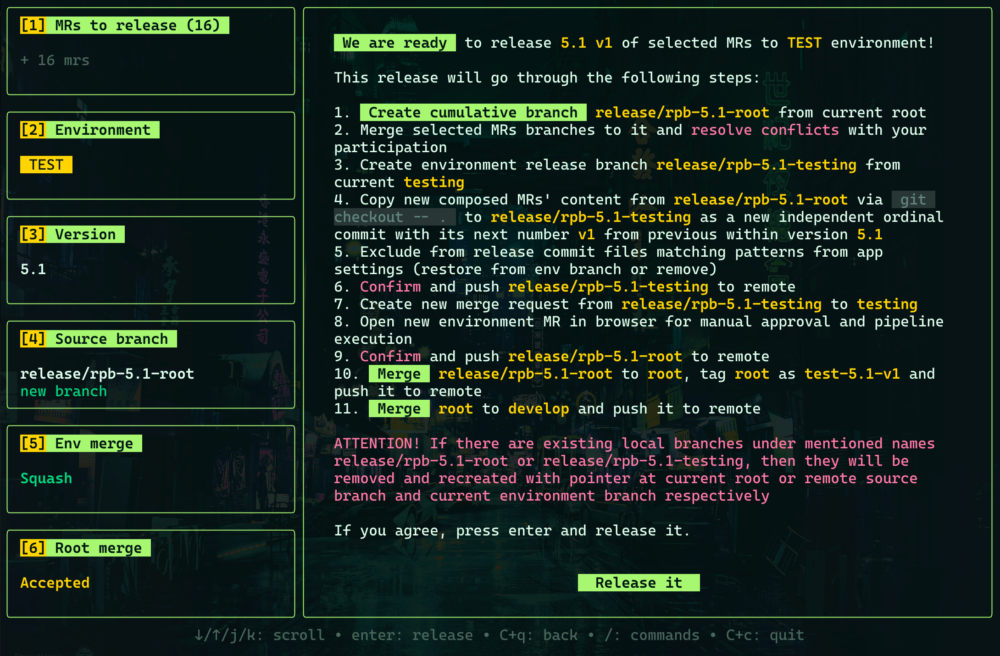
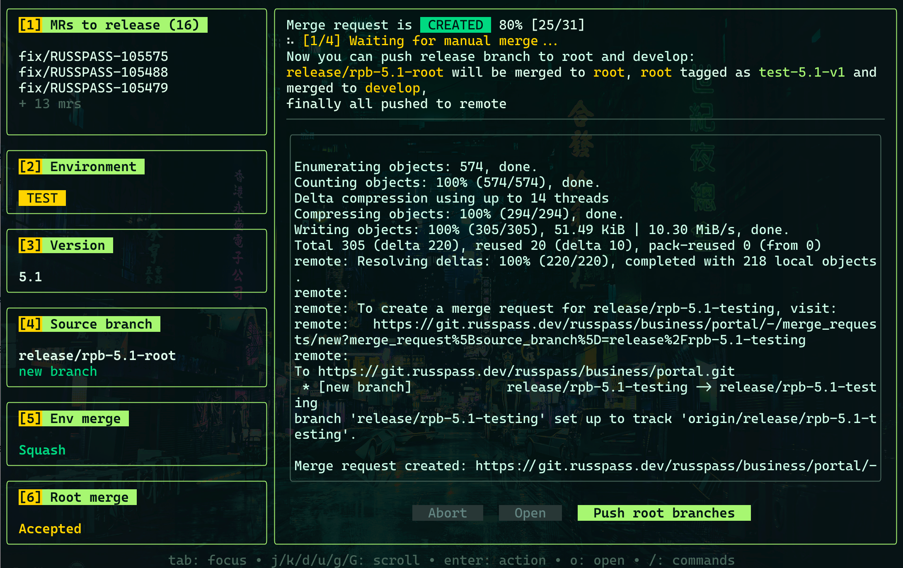

# Relix - GitLab Release Manager TUI

> Automate complex release workflows from your terminal.

Relix is an interactive TUI tool that streamlines GitLab release management -- select Merge Requests, target an environment, set a version, and let it handle the git operations, MR creation, and pipeline monitoring.

## Key Features

- **Interactive MR Selection** -- browse, filter, and select multiple Merge Requests with diff stats and conflict detection
- **Environment Targeting** -- release to DEVELOP, TEST, STAGE, or PROD with configurable branch mappings
- **Automated Git Operations** -- merges, checkouts, commits, pushes, and MR creation in one flow
- **Flexible Merge Strategies** -- squash merge (safe, conflict-free) or regular merge with full commit history
- **Crash Recovery** -- resume interrupted releases exactly where you left off
- **Pipeline Monitoring** -- real-time pipeline status with macOS notifications
- **Secure Credentials** -- stored in your system's keyring, never in plain text
- **Custom Themes** -- full color customization with dynamic ANSI remapping







## Quick Start

```bash
# Build from source
git clone https://github.com/miraxsage/relix.git
cd relix
go build -o relix .

# Run in your project directory
./relix
```

**Prerequisites:** Go 1.25+, Git, GitLab PAT with `api` scope.

## Usage

```bash
relix                         # Run in current directory
relix -d /path/to/project     # Specify project directory
relix --version               # Show version
```

On first run, enter your GitLab URL, email, and token. Then select a project and start creating releases.

---

## Documentation

> 🇬🇧 **English** | 🇷🇺 **Русский**

| English | Русский | Description |
|---------|---------|-------------|
| [Getting Started](docs/en/getting-started.md) | [Начало работы](docs/ru/getting-started.md) | Installation, authentication, first run |
| [Usage Guide](docs/en/usage.md) | [Руководство](docs/ru/usage.md) | Full release workflow, shortcuts, history |
| [Configuration](docs/en/configuration.md) | [Конфигурация](docs/ru/configuration.md) | Environments, themes, exclusions, storage |
| [Architecture](docs/en/architecture.md) | [Архитектура](docs/ru/architecture.md) | Project structure, state machine, key patterns |

## Tech Stack

- **Language:** [Go](https://go.dev/)
- **TUI Framework:** [Bubble Tea](https://github.com/charmbracelet/bubbletea)
- **Styling:** [Lipgloss](https://github.com/charmbracelet/lipgloss)
- **Markdown:** [Glamour](https://github.com/charmbracelet/glamour)
- **Keyring:** [go-keyring](https://github.com/zalando/go-keyring)

---

*Relix is a tool for developers who want to stay in the flow and automate the tedious parts of release management.*
