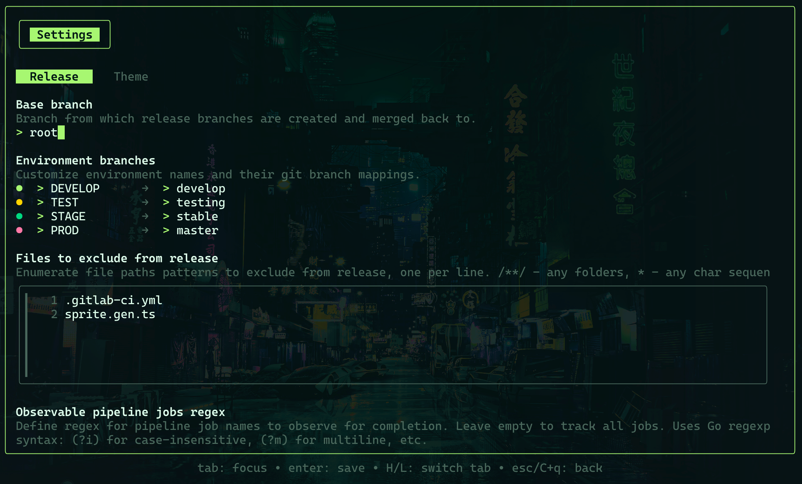
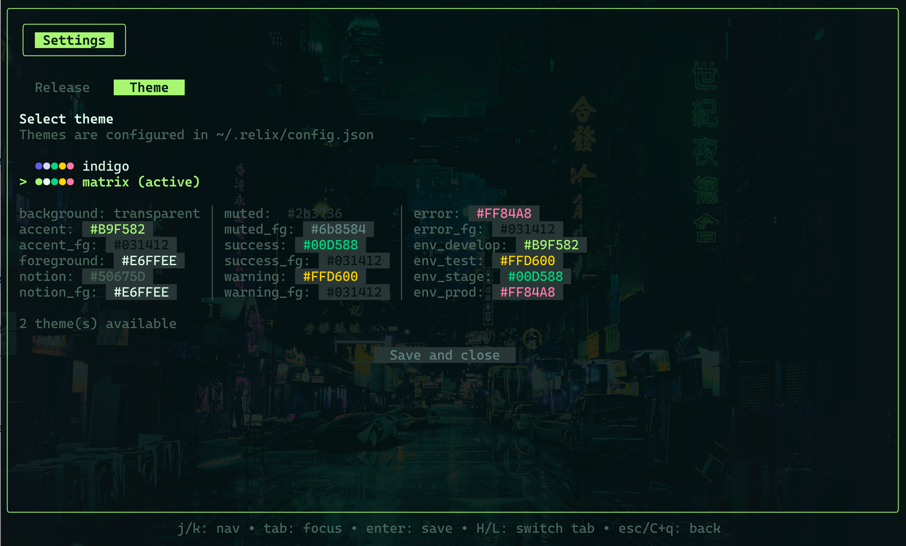

> **🇬🇧 English** | [🇷🇺 Русский](../ru/configuration.md)

[← Usage Guide](usage.md) · [🏠 README](../../README.md) · [Architecture →](architecture.md)

# Configuration

Relix stores its configuration in `~/.relix/config.json`. You can edit settings through the in-app Settings UI (open with `/` → **settings**, or press `s` on the Home screen) or by modifying the JSON file directly.

## Config File

### Location

```
~/.relix/config.json
```

### Structure

```json
{
  "selected_project_id": 12345,
  "selected_project_path": "namespace/project",
  "selected_project_name": "Namespace / Project Name",
  "selected_project_short_name": "project",
  "base_branch": "root",
  "environments": [
    { "name": "develop", "branch_name": "develop" },
    { "name": "test", "branch_name": "testing" },
    { "name": "stage", "branch_name": "stable" },
    { "name": "prod", "branch_name": "master" }
  ],
  "exclude_patterns": ".gitlab-ci.yml\nsprite.gen.ts",
  "pipeline_jobs_regex": "",
  "selected_theme": "indigo",
  "themes": [...]
}
```

The config is auto-saved whenever you change the selected project, modify settings, or switch themes.

---

## Settings UI

The Settings modal is organized into two tabs: **Release** and **Theme**. Switch between tabs using `H` / `L` keys or by clicking the tab headers.

### Release Tab

The Release tab controls all release-related configuration: the base branch, environment branch mappings, file exclusion patterns, and pipeline job regex.



- **Base branch** -- The branch from which release source branches are created and optionally merged back to
- **Environment branches** -- Four configurable environment slots, each with a display name and a git branch name
- **Files to exclude from release** -- Patterns for files that should be excluded from the release build
- **Observable pipeline jobs regex** -- A Go regex pattern to filter which pipeline jobs to monitor for completion notifications (leave empty to track all jobs)

### Theme Tab

The Theme tab lets you select from available themes and preview all color fields. The active theme is highlighted and a full color breakdown is displayed below.



Press `Enter` on **Save and close** to apply changes, or `Esc` / `Ctrl+q` to discard and go back.

---

## Environments

Four environments are configurable, each consisting of a display name and a corresponding git branch:

| Slot | Default Name | Default Branch |
|------|-------------|----------------|
| Environment 1 | DEVELOP | `develop` |
| Environment 2 | TEST | `testing` |
| Environment 3 | STAGE | `stable` |
| Environment 4 | PROD | `master` |

Both display names and branch mappings are editable in the Settings UI. Display names are shown in UPPERCASE throughout the interface. When you select an environment during the release workflow, Relix targets the corresponding git branch.

---

## Base Branch

The base branch (default: `root`) is the foundational branch from which new release source branches are created. When root merge is enabled, the release is merged back into this branch after completion, and the base branch is then merged into `develop`.

Configure via the Settings UI or by editing `"base_branch"` in the config file.

---

## File Exclusions

Define file path patterns to automatically exclude from the release build. These files will be restored from the environment branch (or removed) instead of being overwritten by the source branch content. Enter one pattern per line.

**Example patterns:**

```
.gitlab-ci.yml
sprite.gen.ts
```

### Supported Wildcards

- `*` -- matches any characters within a single filename or path segment
- `**/` -- matches any directory depth (recursive)

### Validation Rules

- No empty lines allowed
- Maximum 80 characters per line
- No invalid characters: `< > : " | ? \`
- Overly broad patterns are rejected (`*`, `**`, `/`)

---

## Themes

Relix supports full color customization through themes. The default theme is `indigo`. A `matrix`-style green theme is also included.

### Adding Custom Themes

Custom themes must be added directly to `~/.relix/config.json` in the `"themes"` array. The Settings UI allows you to browse and select from existing themes, preview their colors, but not create new ones from within the app.

### Required Color Fields

Every theme must define these core colors:

| Field | Description |
|-------|-------------|
| `name` | Unique theme identifier (used in `selected_theme`) |
| `accent` | Primary accent color (hex, e.g., `#6366F1`) |
| `foreground` | Main text color (hex) |
| `notion` | Subtle/secondary UI element color (hex) |
| `success` | Success state color (hex) |
| `warning` | Warning state color (hex) |
| `error` | Error state color (hex) |

### Optional Color Fields

These fields are automatically derived if omitted. Override them for fine-grained control:

| Field | Fallback When Omitted |
|-------|----------------------|
| `background` | Transparent |
| `accent_foreground` | High-contrast color against `accent` |
| `notion_foreground` | Same as `foreground` |
| `success_foreground` | Black or white (best contrast against `success`) |
| `warning_foreground` | Black or white (best contrast against `warning`) |
| `error_foreground` | Black or white (best contrast against `error`) |
| `muted` | Derived from `accent` |
| `muted_foreground` | Derived from `foreground` |
| `env_develop` | Same as `success` |
| `env_test` | Same as `warning` |
| `env_stage` | Same as `error` |
| `env_prod` | Same as `accent` |

### Example Theme

```json
{
  "name": "ocean",
  "accent": "#0077B6",
  "foreground": "#CAF0F8",
  "notion": "#023E8A",
  "success": "#06D6A0",
  "warning": "#FFD166",
  "error": "#EF476F"
}
```

Add this object to the `"themes"` array in your config file, then select it from the Theme tab in Settings.

---

## Credentials

GitLab credentials are stored in your operating system's native keyring:

- **macOS** -- Keychain
- **Windows** -- Credential Manager
- **Linux** -- Secret Service (GNOME Keyring, KWallet, etc.)

Stored credentials include:

- GitLab instance URL
- Account email
- Personal Access Token

Credentials are **never** written to disk in plain text. To update them, use the Command Menu (`/` → **logout**), which clears the stored credentials and returns you to the authentication screen.

---

## Storage Locations

| Path | Purpose |
|------|---------|
| `~/.relix/config.json` | User preferences, selected project, themes |
| `~/.relix/release.json` | In-progress release state (deleted on completion) |
| `~/.local/.relix/releases/index.json` | Release history index (lightweight list data) |
| `~/.local/.relix/releases/{timestamp}.json` | Individual release details (full terminal output, MR metadata) |
| System keyring | GitLab credentials (URL, email, token) |

---

## See Also

- [Usage Guide](usage.md) -- how environments and exclusions affect the release workflow
- [Architecture](architecture.md) -- how configuration is loaded and persisted internally
- [Getting Started](getting-started.md) -- initial setup and authentication
