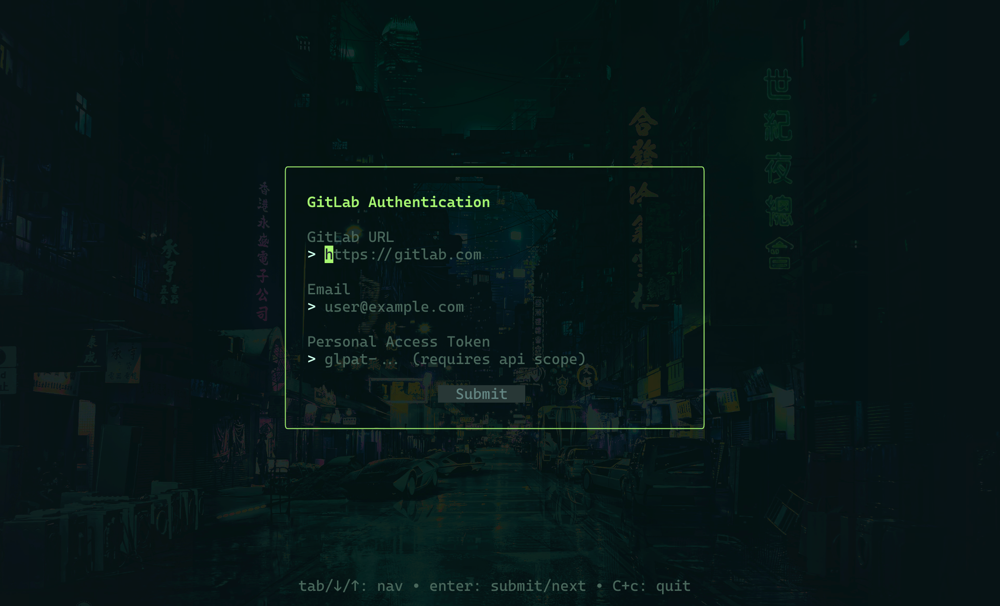
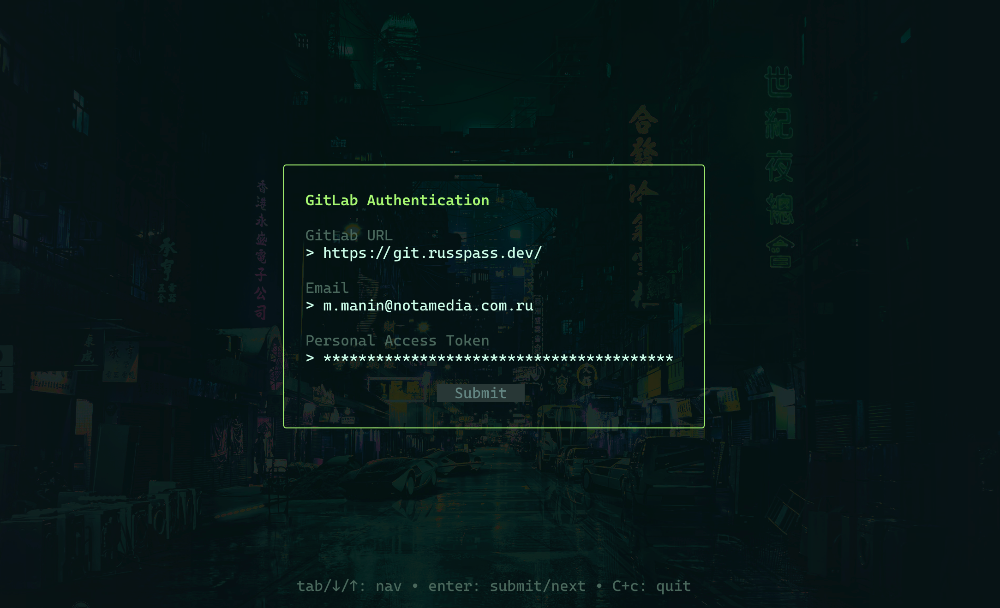
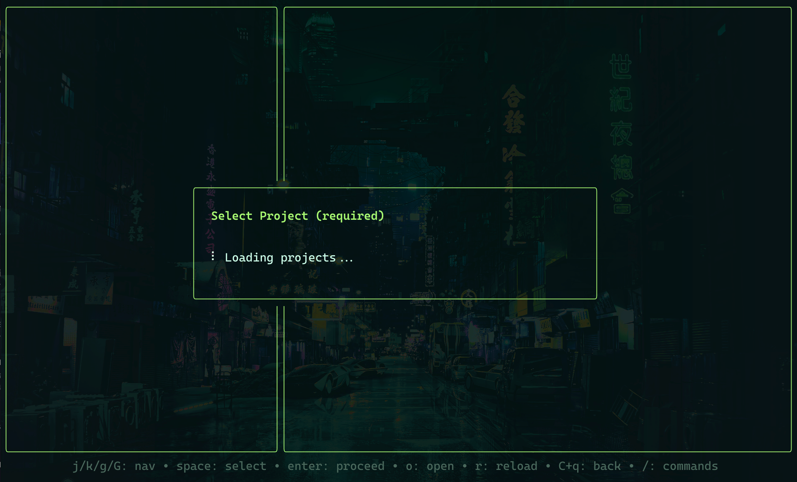
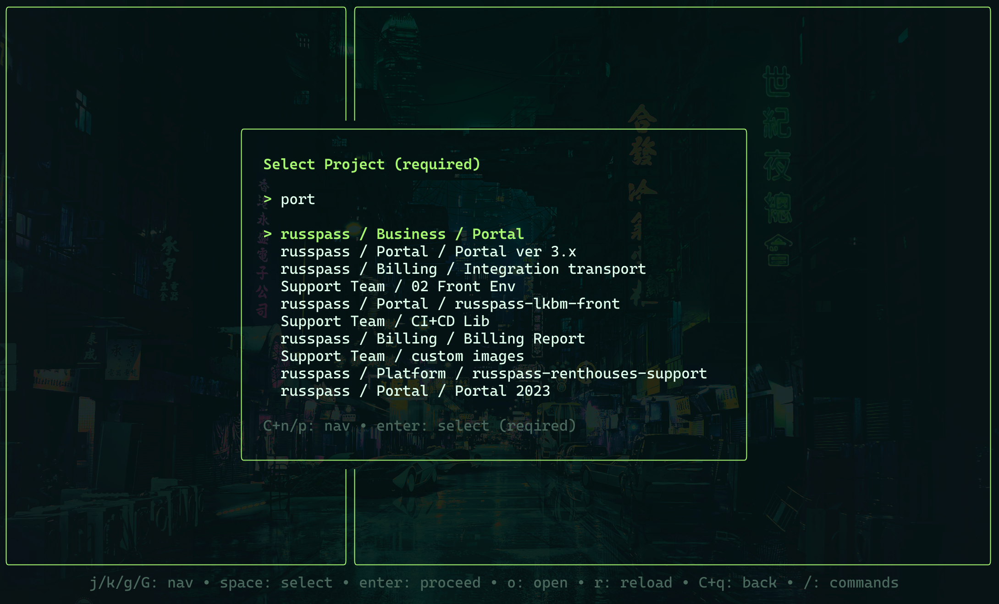

> **🇬🇧 English** | [🇷🇺 Русский](../ru/getting-started.md)

[🏠 README](../../README.md) · [Usage Guide →](usage.md)

# Getting Started

## Prerequisites

Before installing Relix, make sure you have the following:

- **Go** 1.25 or higher -- required to build from source
- **Git** installed and available in your PATH
- **GitLab Personal Access Token (PAT)** with the `api` scope -- needed for Relix to interact with the GitLab API on your behalf

> **How to create a GitLab PAT:**
> Navigate to your GitLab instance → **Settings → Access Tokens**, create a new token with the **`api`** scope, and save it somewhere safe. You will need it during the first run.

## Installation

### Build from Source

```bash
git clone https://github.com/miraxsage/relix.git
cd relix
go build -o relix .
```

This produces a `relix` binary in the current directory. You can move it anywhere in your PATH for convenience:

```bash
sudo mv relix /usr/local/bin/
```

## First Run

Launch Relix from the root of any Git repository:

```bash
./relix
```

Or specify a project directory explicitly:

```bash
./relix -d /path/to/your/project
```

### CLI Flags

| Flag | Description |
|------|-------------|
| `-d`, `--project-directory` | Project root directory path (default: current directory) |
| `-h`, `--help` | Show help message and exit |
| `-v`, `--version` | Show version number and exit |

## Authentication

On the very first launch, Relix presents an authentication form where you enter your GitLab credentials. The form has three fields:

1. **GitLab URL** -- the base URL of your GitLab instance (e.g., `https://gitlab.com`)
2. **Email** -- your GitLab account email address
3. **Personal Access Token** -- the PAT you created with the `api` scope

Use `Tab` or arrow keys to navigate between fields, and press `Enter` to submit.



The placeholders guide you through what is expected in each field. Once you fill in all three fields, press the **Submit** button:



Credentials are stored securely in your operating system's keyring (macOS Keychain, Windows Credential Manager, or Linux Secret Service). They are **never** stored in plain text and persist across sessions, so you only need to authenticate once.

## Project Selection

After successful authentication, Relix needs to know which GitLab project you want to manage. It fetches the list of projects available to your account:



Once loaded, you can search and filter projects by typing. The list updates in real time as you type. Use arrow keys or `Ctrl+n` / `Ctrl+p` to navigate, and `Enter` to select:



Your selected project is remembered between sessions. You can switch projects at any time via the Command Menu (`/` → **project**).

## Next Steps

With authentication complete and a project selected, you are ready to start creating releases. Continue to the **[Usage Guide](usage.md)** for a full walkthrough of the release workflow -- from selecting Merge Requests to monitoring the pipeline.

## See Also

- [Usage Guide](usage.md) -- full release workflow walkthrough
- [Configuration](configuration.md) -- customize environments, themes, and file exclusions
- [Architecture](architecture.md) -- how Relix works internally
